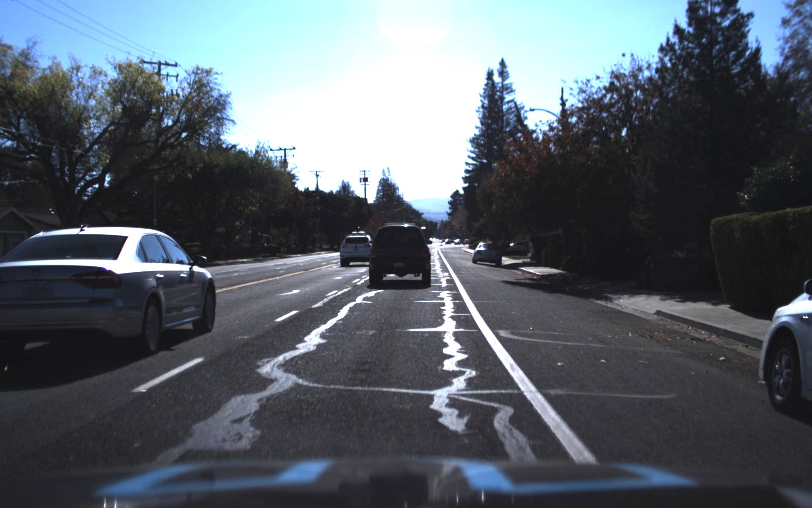
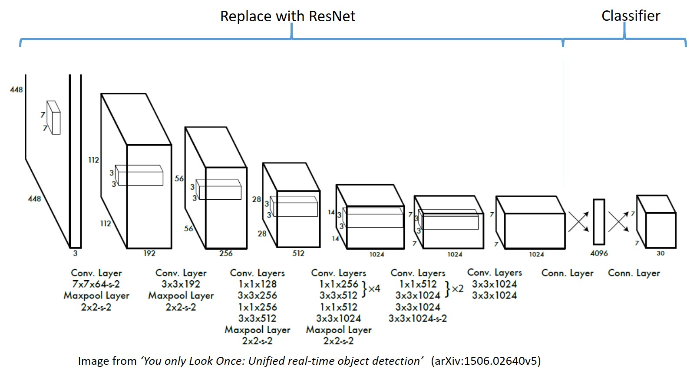
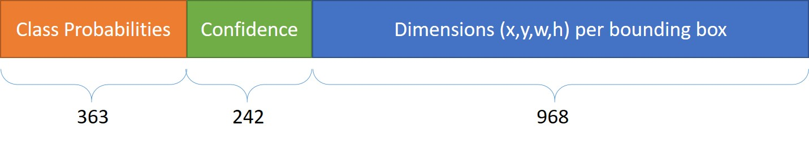
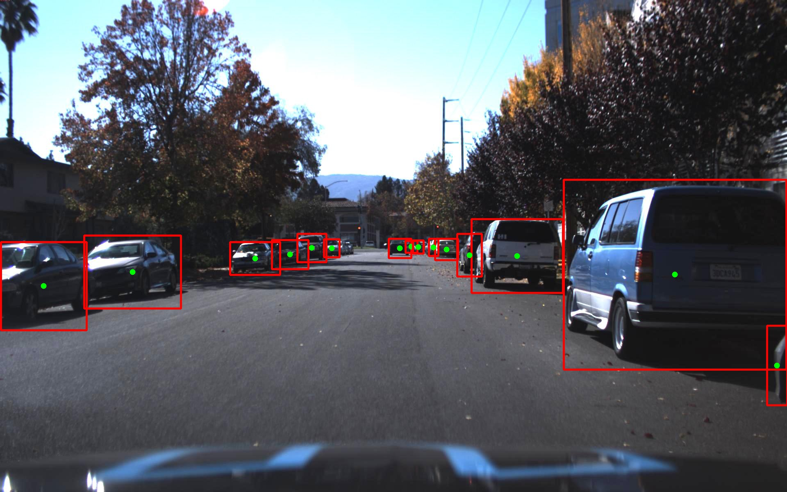
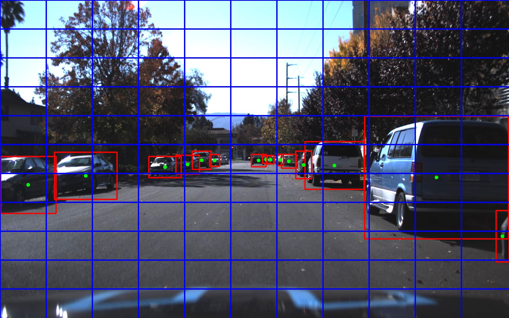
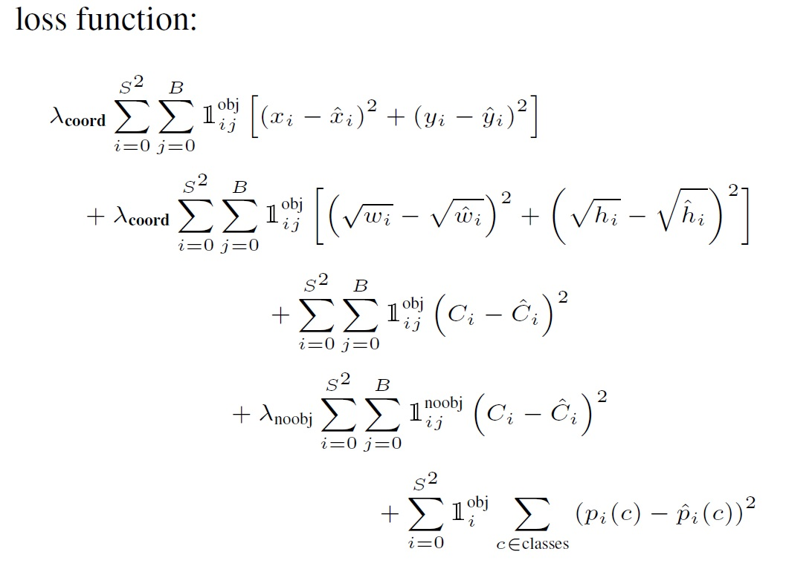
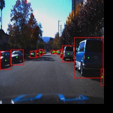
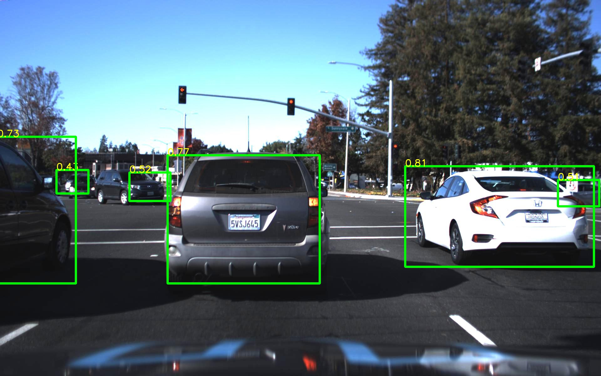
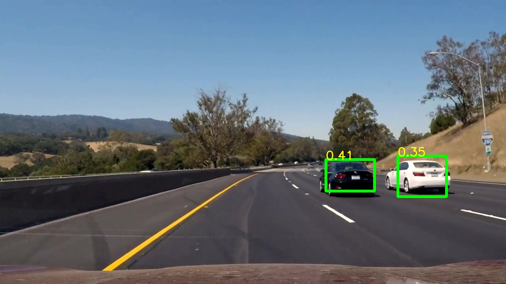
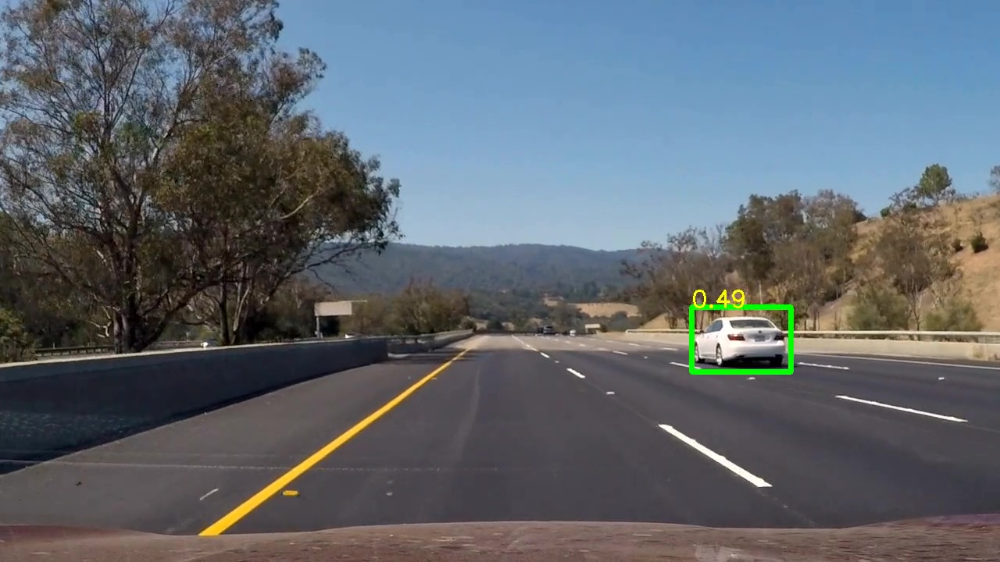

# Implementing YOLO using ResNet as feature extractor #
### Trained on Udacity's car dataset (no pre-trained classifier weights) ##



## Abstract ##
In this project I have used a pre-trained ResNet50 network, removed its classifier layers so it becomes a feature extractor and add the YOLO classifier layer instead (randomly initialized). I then train the network on Udacity's crowdAI dataset to detect cars in image frames.

This project was made only as a means to learn more about deep learning, training networks, transfer learning and implementing an actual paper (my first!).


## The Dataset ##
Udacity has made available an annotated car (and a few other objects) dataset here:https://github.com/udacity/self-driving-car/tree/master/annotations
I've used the 'Dataset1', annotated by CrowdAI for this project. Please take a look at the 'Dataset Exploration.ipynb' jupyter notebook where I've explored the dataset.

In summary, the dataset identifies 3 classes: Car, Truck and Pedestrian and also lists bounding box coordinates for each of the objects in datapoint (image), in a CSV file.
The dataset is uneven across different classes. It can additionally be noted that a certain view (rear) of cars dominates the rest (side and front). The lighting condition is constant throughout the capture and hence we will need data augumentation to help the network generalize better.

If you'd like to play with the training bit, download the dataset and extract it to 'udacity-object-detection-crowdai' in the root of the project folder.

## The Model ##

The YOLO network has two components as do most networks: 
- A feature extractor
- A classifier

The paper's author explains that they used GoogLeNet (inception) inspired architecture for their feature extractor, that was trained on PASCAL VOC dataset prior to making it part of the object detection network. We can skip this step and use a pre-trained network, that performs well on classification tasks. I've chosen ResNet for this purpose.

I then add two dense/fully connected layers to the feature extractor's output that has random weight initialization and produces an output with the desired dimensions.



### YOLO ###
There have been many articles and videos describing this approach originally presented in the paper: https://arxiv.org/abs/1506.02640 

A resource I have found useful was the demo by author of the paper itself: https://youtu.be/NM6lrxy0bxs 

This README won't go into how YOLO itself works but instead focuses on how to prepare/explore dataset and train the network on a specific dataset.

### ResNet ###
ResNet (https://arxiv.org/abs/1512.03385) has won several competitions and its architecture allows for better learning in deeper networks. I've used the Keras implementation with weights of ResNet50 from here https://github.com/fchollet/deep-learning-models.git and modified the code to have the YOLO classifier at the end.


## Training and Data Augumentation ##
The key part of this implementation was training the network, as it required defining the custom loss function in Tensorflow and image and frame data manipulation for better generalization.

### Grids and bounding boxes ###
The object detection approach in YOLO requires us to divide the image into gridcell(S) and that each grid cell will be responsible for the detection and prediction(C) of bounding boxes (B).
I've chosen to use a 11x11 grid over the images and 2 bounding box predictions per grid cell, to keep sufficient resolution and at the same time have a smaller output prediction to train for.

Since we have 3 classes, the output we will need is: S*S *(C + B(5)) = 121*(3+2(5)) = 1573 



Having a 11x11 grid does however put some detections within the same grid cell and for the sake of simplicity (and computation power), I've only considered one detection in such cases.




The network is trained on 224x224x3 images and so our dataset images are resized with their corresponding label coordinates adjusted as well.


### The Loss function ###
Keras and TF have the standard loss defintions however, the YOLO paper uses a custom objective function that is fine tuned to improve stability (penalize loss from grid cells that do not have an object) and weigh dimension error in smaller boxes more than that in larger boxes:




I've used Tensorflow's 'while_loop' to create the graph that calculates loss per each batch. All operations in the my loss function (see loop_body() in model_continue_train.py) are tensorflow operations, hence these will all be run only when the graph is computed, taking advantage of any hardware optimization.

### Data augumentation ###
As mentioned in the paper, I've also randomly scaled, translated and adjusted the saturation values of the data point while **generating a batch for training and validation**:
```
    #translate_factor
    tr = np.random.random() * 0.2 + 0.01
    tr_y = np.random.randint(rows*-tr, rows*tr)
    tr_x = np.random.randint(cols*-tr, cols*tr)
        r = np.random.rand()

    if r < 0.3:
        #translate image
        M = np.float32([[1,0,tr_x], [0,1,tr_y]])
        img = cv2.warpAffine(img, M, (cols,rows))
        frame = coord_translate(frame, tr_x, tr_y)
    elif r < 0.6:
        #scale image keeping the same size
        placeholder = np.zeros_like(img)
        meta = cv2.resize(img, (0,0), fx=sc, fy=sc)
        if sc < 1:
            placeholder[:meta.shape[0], :meta.shape[1]] = meta
        else:
            placeholder = meta[:placeholder.shape[0], :placeholder.shape[1]]
        img = placeholder
        frame = coord_scale(frame, sc)
```


### Learning Rate and Epochs ###
As described in the paper, I started to train with 1e-3 learning rate, then 1e-2 followed by 1e-3, 1e-4, 1e-5. All along saving model checkpoints using Keras' callback feature.


### Amazon AWS GPU Instance ###
Training of this magnitude definitely needed some beefed up hardware and since I'm a console guy (PS4), I resorted to the EC instances Amazon provides (https://aws.amazon.com/ec2/instance-types/). Udacity's Amazon credits came in handy!

At first, I tried the g2.xlarge instance that Udacity's project on Traffic sign classifier had suggested (did that on my laptop back then) but the memory or the compute capability was nowhere near sufficient, since TF apparently drops to CPU and RAM after detecting that there isn't sufficient capacity on the GPU.

In the end, p2.xlarge EC2 instance were what I trained my network on. There was ~10GB GPU memory utilization and ~92% GPU at peak. My network trained pretty well on this setup.

NOTE: I faced a lot of issues when getting setup on the remote instance due to issues with certain libraries being out of date and anaconda not having those updates. Luckily Amazon released its latest (v6 at time) deep learning Ubuntu AMI which worked just fine out of the box. So if you are using EC2, make sure to test sample code and library imports in python first to make sure the platform is ready for your code.


## Testing ##
Check out the 'Vehicle Detection.ipynb' notebook to see the network in use. It performs well on the dataset and also the sample highway video that the network has never seen before.

If you're interested to try it out yourself you can follow the notebook ('Vehicle Detection.ipynb') or use the `predict.py` as follows:

`
python predict.py <path_to_image>
`

**Sample output images:**


**Prediction on images the network has never seen:**
 


## Conclusion ##
It worked! Alhamdulillah.
The network trained from scratch and was able to detect cars in a video that it had never seen before. It has some problems with far away objects and also the detections are not very smooth across frames. 

It will be worth trying to remove some layers from ResNet and see if the network performs any faster.

I'd love to hear your suggestions on improving the project and also if you have any questions on this.

